# 🗄️ Complete Database Schema - EduAI Platform

## Overview
**Total Tables**: 15  
**Total Columns**: 215+  
**Database**: PostgreSQL 14+ with JSONB support  
**ORM**: SQLAlchemy 2.0+  
**Architecture**: Dual-platform (Student Learning + Recruiter Management)

---

## 📊 Enhanced Entity Relationship Diagram

```mermaid
%%{init: {'theme':'dark'}}%%
erDiagram
    %% Student Learning System
    USERS ||--o| ONBOARDING : "has profile"
    USERS ||--o{ LEARNING_PLANS : "creates plans"
    USERS ||--o{ LEARNING_PATHS : "enrolls in"
    USERS ||--o{ DAY_PROGRESS : "tracks daily"
    USERS ||--o{ QUIZZES : "takes quizzes"
    USERS ||--o{ QUIZ_SUBMISSIONS : "submits answers"
    USERS ||--o{ YOUTUBE_SCHEDULES : "schedules videos"
    USERS ||--o| STUDENT_PROFILE_SUMMARY : "has summary"
    USERS ||--o| CANDIDATE_VECTOR : "has embedding"
    
    %% Recruiter System
    USERS ||--o{ JOBS : "posts jobs"
    USERS ||--o{ SHORTLISTS : "shortlists candidates"
    USERS ||--o{ EMAIL_APPLICATIONS : "receives applications"
    USERS ||--o{ RECRUITER_INTERACTIONS : "interacts with"
    USERS ||--o{ JOB_POSTINGS : "creates postings"
    USERS ||--o{ CANDIDATE_MATCHES : "matches candidates"
    
    %% Learning Plan Relationships
    LEARNING_PLANS ||--o{ LEARNING_PATHS : "contains months"
    LEARNING_PLANS ||--o{ DAY_PROGRESS : "tracks progress"
    LEARNING_PLANS ||--o{ QUIZZES : "includes quizzes"
    LEARNING_PLANS ||--o{ QUIZ_SUBMISSIONS : "records submissions"
    
    %% Quiz Relationships
    QUIZZES ||--o{ QUIZ_SUBMISSIONS : "receives submissions"
    
    %% Recruiter Relationships
    JOBS ||--o{ SHORTLISTS : "has shortlists"
    JOB_POSTINGS ||--o{ CANDIDATE_MATCHES : "generates matches"
    
    USERS {
        int id PK "Primary Key"
        string email UK "Unique Email"
        string hashed_password "Bcrypt Hash"
        string google_id UK "Google OAuth ID"
        string google_email "Google Email"
        string google_name "Google Name"
        string google_picture "Profile Picture URL"
        string google_access_token "OAuth Access Token"
        string google_refresh_token "OAuth Refresh Token"
        boolean is_google_authenticated "OAuth Status"
        string user_type "student or recruiter"
        string phone_number "Contact Number"
        boolean phone_verified "Phone Verified"
        datetime created_at "Account Created"
        int created_by_recruiter_id FK "Added By Recruiter"
        string source "platform or email"
        string linkedin_connection_id "Composio LinkedIn"
        json linkedin_profile_data "LinkedIn Data"
        datetime linkedin_connected_at "LinkedIn Connected"
        string github_connection_id "Composio GitHub"
        json github_profile_data "GitHub Data"
        datetime github_connected_at "GitHub Connected"
        string twitter_connection_id "Composio Twitter"
        json twitter_profile_data "Twitter Data"
        datetime twitter_connected_at "Twitter Connected"
        int current_plan_id "Active Plan"
        int current_month_index "Current Month"
        int current_day "Current Day"
    }
    
    ONBOARDING {
        int id PK
        int user_id FK "User Reference"
        string name "Full Name"
        string grade "Education Level"
        jsonb career_goals "Career Objectives Array"
        jsonb current_skills "Skills Array"
        string time_commitment "Daily Study Time"
    }
    
    LEARNING_PLANS {
        int id PK
        int user_id FK "Plan Owner"
        string title "Plan Title"
        int total_years "Duration 1-3 years"
        jsonb plan "Complete Plan Structure"
        datetime created_at "Plan Created"
        datetime updated_at "Last Updated"
    }
    
    LEARNING_PATHS {
        int id PK
        int plan_id FK "Parent Plan"
        int user_id FK "Student"
        int global_month_index "Month 1-36"
        int year_number "Year 1-3"
        int month_of_year "Month 1-12"
        string title "Month Title"
        string status "locked active completed"
        int current_day "Day 1-30"
        int days_completed "Completed Count"
        int total_days "Total 30 Days"
        datetime started_at "Month Started"
        datetime completed_at "Month Completed"
        datetime last_activity_at "Last Activity"
        json days_data "Day Details"
        datetime created_at "Record Created"
        datetime updated_at "Last Updated"
    }
    
    DAY_PROGRESS {
        int id PK
        int user_id FK "Student"
        int plan_id FK "Plan Reference"
        int month_index "Month Number"
        int day_number "Day 1-30"
        string status "locked active completed failed"
        datetime started_at "Day Started"
        datetime completed_at "Day Completed"
        int quiz_score "Latest Score 0-100"
        int quiz_attempts "Attempt Count"
        int best_score "Best Score"
        boolean content_viewed "Content Viewed"
        int time_spent "Seconds Spent"
        boolean can_proceed "Can Move Next"
        datetime created_at "Record Created"
        datetime updated_at "Last Updated"
    }
    
    QUIZZES {
        int id PK
        int user_id FK "Quiz Owner"
        int plan_id FK "Plan Reference"
        int month_index "Month Number"
        int day "Day 1-30"
        string title "Quiz Title"
        jsonb questions "Questions Array"
        int required_score "Pass Score 70"
        datetime created_at "Quiz Created"
    }
    
    QUIZ_SUBMISSIONS {
        int id PK
        int user_id FK "Student"
        int plan_id FK "Plan Reference"
        int month_index "Month Number"
        int day "Day Number"
        int quiz_id FK "Quiz Reference"
        jsonb answers "Selected Answers"
        jsonb question_results "Detailed Results"
        int score "Score 0-100"
        int passed "0 or 1"
        int attempt_number "Attempt Sequence"
        int time_taken "Seconds Taken"
        datetime created_at "Submitted At"
    }
    
    YOUTUBE_SCHEDULES {
        int id PK
        int user_id FK "Schedule Owner"
        string playlist_id "YouTube Playlist ID"
        string playlist_url "Full URL"
        string playlist_title "Playlist Title"
        int daily_minutes "Daily Watch Time"
        jsonb schedule "Daily Video Schedule"
        string start_time "Start Time HH:MM"
        int duration_minutes "Session Duration"
        datetime created "Schedule Created"
    }
    
    JOBS {
        int id PK
        int recruiter_id FK "Posting Recruiter"
        string title "Job Title"
        text description "Job Description"
        json requirements "Requirements Array"
        string location "Job Location"
        string salary_range "Salary Range"
        string status "active inactive"
        datetime created_at "Posted At"
    }
    
    SHORTLISTS {
        int id PK
        int recruiter_id FK "Recruiter"
        int job_id FK "Job Reference"
        int student_id FK "Candidate"
        int match_score "AI Score 0-100"
        text notes "Recruiter Notes"
        string status "shortlisted interviewed hired rejected"
        datetime created_at "Shortlisted At"
        string source "platform or email"
    }
    
    EMAIL_APPLICATIONS {
        int id PK
        int recruiter_id FK "Receiving Recruiter"
        string sender_email "Applicant Email"
        string sender_name "Applicant Name"
        string subject "Email Subject"
        text content "Email Body"
        json attachments "Attachment Metadata"
        datetime received_at "Email Received"
        boolean processed "Processing Status"
        int student_id FK "Matched Student"
        int priority_score "AI Priority 0-100"
        json keywords_matched "Matched Keywords"
    }
    
    STUDENT_PROFILE_SUMMARY {
        int id PK
        int user_id FK "Student Reference"
        string summary_text "AI Generated Summary"
        jsonb interests "Interests Array"
        jsonb skills_tags "Skills Array"
        jsonb vector "Embedding Vector 768-dim"
        jsonb graph_neighbors "Related Students"
        datetime created_at "Summary Created"
        datetime updated_at "Last Updated"
    }
    
    CANDIDATE_VECTOR {
        int id PK
        int user_id FK "Candidate Reference"
        jsonb vector "Embedding Vector 768-dim"
        string summary_text "Summary Text"
        jsonb skills_tags "Skills Array"
        datetime created_at "Vector Created"
        datetime updated_at "Last Updated"
    }
    
    RECRUITER_INTERACTIONS {
        int id PK
        int recruiter_id FK "Recruiter"
        int candidate_id FK "Candidate"
        string interaction_type "email profile interview"
        jsonb details "Interaction Metadata"
        text notes "Interaction Notes"
        string status "active archived rejected hired"
        datetime created_at "Interaction Created"
        datetime updated_at "Last Updated"
    }
    
    JOB_POSTINGS {
        int id PK
        int recruiter_id FK "Posting Recruiter"
        string title "Job Title"
        text description "Full Description"
        jsonb requirements "Requirements Array"
        jsonb skills "Required Skills Array"
        string location "Job Location"
        int salary_min "Minimum Salary"
        int salary_max "Maximum Salary"
        boolean is_active "Active Status"
        datetime created_at "Posted At"
        datetime updated_at "Last Updated"
    }
    
    CANDIDATE_MATCHES {
        int id PK
        int recruiter_id FK "Recruiter"
        int job_id FK "Job Posting"
        int candidate_id FK "Candidate"
        string match_score "Match Score String"
        jsonb match_reasons "Match Reasons Array"
        string status "new contacted interview offer hired rejected"
        datetime created_at "Match Created"
        datetime updated_at "Last Updated"
    }
```



---

## 📋 Detailed Table Specifications

### 🎓 Student Learning System Tables

#### 1. **users** - Core User Management
**Purpose**: Unified table for students and recruiters with OAuth integration

| Column | Type | Constraints | Description | Index |
|--------|------|-------------|-------------|-------|
| id | Integer | PRIMARY KEY | Auto-increment user ID | ✓ |
| email | String | UNIQUE, NOT NULL | User email address | ✓ |
| hashed_password | String | NULLABLE | Bcrypt hashed password | |
| google_id | String | UNIQUE, NULLABLE | Google OAuth unique ID | ✓ |
| google_email | String | NULLABLE | Google account email | |
| google_name | String | NULLABLE | Google display name | |
| google_picture | String | NULLABLE | Google profile picture URL | |
| google_access_token | String | NULLABLE | OAuth access token | |
| google_refresh_token | String | NULLABLE | OAuth refresh token | |
| is_google_authenticated | Boolean | DEFAULT FALSE | OAuth authentication status | |
| user_type | String | DEFAULT 'student' | Role: student/recruiter | ✓ |
| phone_number | String | NULLABLE | Contact phone number | |
| phone_verified | Boolean | DEFAULT FALSE | Phone verification status | |
| created_at | DateTime | DEFAULT NOW | Account creation timestamp | ✓ |
| created_by_recruiter_id | Integer | FK(users.id) | Recruiter who added candidate | |
| source | String | DEFAULT 'platform' | Registration source | |
| linkedin_connection_id | String | NULLABLE | Composio LinkedIn connection | |
| linkedin_profile_data | JSON | NULLABLE | LinkedIn profile JSON | |
| linkedin_connected_at | DateTime | NULLABLE | LinkedIn connection time | |
| github_connection_id | String | NULLABLE | Composio GitHub connection | |
| github_profile_data | JSON | NULLABLE | GitHub profile JSON | |
| github_connected_at | DateTime | NULLABLE | GitHub connection time | |
| twitter_connection_id | String | NULLABLE | Composio Twitter connection | |
| twitter_profile_data | JSON | NULLABLE | Twitter profile JSON | |
| twitter_connected_at | DateTime | NULLABLE | Twitter connection time | |
| current_plan_id | Integer | NULLABLE | Active learning plan ID | |
| current_month_index | Integer | NULLABLE | Current month in plan | |
| current_day | Integer | NULLABLE | Current day in month | |

**Relationships**: onboarding (1:1), learning_plans (1:N), jobs (1:N), shortlists (1:N)

---

#### 2. **onboarding** - Student Profile Setup
**Purpose**: Initial student information and learning preferences

| Column | Type | Constraints | Description |
|--------|------|-------------|-------------|
| id | Integer | PRIMARY KEY | Unique onboarding ID |
| user_id | Integer | FK(users.id), UNIQUE | Associated user |
| name | String | NOT NULL | Student full name |
| grade | String | NOT NULL | Education level |
| career_goals | JSONB | NOT NULL | Career objectives array |
| current_skills | JSONB | NOT NULL | Existing skills array |
| time_commitment | String | NOT NULL | Daily study time |

**JSONB Example**:
```json
{
  "career_goals": ["Full Stack Developer", "AI Engineer", "Cloud Architect"],
  "current_skills": ["Python", "JavaScript", "React", "SQL"]
}
```

---

#### 3. **learning_plans** - Master Learning Plans
**Purpose**: High-level learning plan structure (1-3 years)

| Column | Type | Constraints | Description |
|--------|------|-------------|-------------|
| id | Integer | PRIMARY KEY | Unique plan ID |
| user_id | Integer | FK(users.id) | Plan owner |
| title | String | DEFAULT 'Personalized Learning Plan' | Plan title |
| total_years | Integer | NOT NULL | Duration 1-3 years |
| plan | JSONB | NOT NULL | Complete plan structure |
| created_at | DateTime | DEFAULT NOW | Plan creation |
| updated_at | DateTime | DEFAULT NOW | Last update |

**JSONB Structure**:
```json
{
  "months": [
    {
      "index": 1,
      "title": "Python Fundamentals & Syntax",
      "goals": ["Master Python basics", "Build 3 projects"],
      "topics": ["Variables", "Functions", "OOP", "File I/O"],
      "status": "active",
      "days_generated": true,
      "days": [...]
    }
  ]
}
```

---

#### 4. **learning_paths** - Monthly Progress Tracking
**Purpose**: Track progress through each month (30 days)

| Column | Type | Constraints | Description |
|--------|------|-------------|-------------|
| id | Integer | PRIMARY KEY | Unique path ID |
| plan_id | Integer | FK(learning_plans.id), INDEX | Parent plan |
| user_id | Integer | FK(users.id), INDEX | Path owner |
| global_month_index | Integer | NOT NULL | Month 1-36 |
| year_number | Integer | NOT NULL | Year 1-3 |
| month_of_year | Integer | NOT NULL | Month 1-12 |
| title | String | NOT NULL | Month title |
| status | String | DEFAULT 'locked' | locked/active/completed |
| current_day | Integer | DEFAULT 1 | Current day 1-30 |
| days_completed | Integer | DEFAULT 0 | Completed days count |
| total_days | Integer | DEFAULT 30 | Total days |
| started_at | DateTime | NULLABLE | Month start |
| completed_at | DateTime | NULLABLE | Month completion |
| last_activity_at | DateTime | NULLABLE | Last activity |
| days_data | JSON | NULLABLE | Day completion details |
| created_at | DateTime | DEFAULT NOW | Record creation |
| updated_at | DateTime | DEFAULT NOW | Last update |

---

#### 5. **day_progress** - Daily Learning Progress
**Purpose**: Granular tracking of daily activities and quiz performance

| Column | Type | Constraints | Description |
|--------|------|-------------|-------------|
| id | Integer | PRIMARY KEY | Unique progress ID |
| user_id | Integer | FK(users.id), INDEX | Student ID |
| plan_id | Integer | FK(learning_plans.id), INDEX | Plan ID |
| month_index | Integer | INDEX | Month number |
| day_number | Integer | INDEX | Day 1-30 |
| status | String | DEFAULT 'locked' | locked/active/completed/failed |
| started_at | DateTime | NULLABLE | Day start |
| completed_at | DateTime | NULLABLE | Day completion |
| quiz_score | Integer | NULLABLE | Latest score 0-100 |
| quiz_attempts | Integer | DEFAULT 0 | Attempt count |
| best_score | Integer | NULLABLE | Best score achieved |
| content_viewed | Boolean | DEFAULT FALSE | Content viewed flag |
| time_spent | Integer | DEFAULT 0 | Time in seconds |
| can_proceed | Boolean | DEFAULT FALSE | Can move to next day |
| created_at | DateTime | DEFAULT NOW | Record creation |
| updated_at | DateTime | DEFAULT NOW | Last update |

**Composite Index**: (user_id, plan_id, month_index, day_number)

---

#### 6. **quizzes** - Quiz Definitions
**Purpose**: Store quiz questions and correct answers

| Column | Type | Constraints | Description |
|--------|------|-------------|-------------|
| id | Integer | PRIMARY KEY | Unique quiz ID |
| user_id | Integer | FK(users.id), INDEX | Quiz owner |
| plan_id | Integer | FK(learning_plans.id), INDEX | Plan reference |
| month_index | Integer | NOT NULL | Month number |
| day | Integer | NOT NULL | Day 1-30 |
| title | String | NOT NULL | Quiz title |
| questions | JSONB | NOT NULL | Questions array |
| required_score | Integer | DEFAULT 70 | Pass score percentage |
| created_at | DateTime | DEFAULT NOW | Quiz creation |

**JSONB Structure**:
```json
{
  "questions": [
    {
      "question": "What is Python's primary use case?",
      "options": ["Web Development", "Data Science", "Both", "Neither"],
      "correct_index": 2,
      "explanation": "Python is versatile for both web and data science"
    }
  ]
}
```

---

#### 7. **quiz_submissions** - Quiz Attempt Records
**Purpose**: Record all quiz attempts with detailed results

| Column | Type | Constraints | Description |
|--------|------|-------------|-------------|
| id | Integer | PRIMARY KEY | Unique submission ID |
| user_id | Integer | FK(users.id), INDEX | Student ID |
| plan_id | Integer | FK(learning_plans.id), INDEX | Plan reference |
| month_index | Integer | NOT NULL | Month number |
| day | Integer | NOT NULL | Day number |
| quiz_id | Integer | FK(quizzes.id), INDEX | Quiz reference |
| answers | JSONB | NOT NULL | Selected answers |
| question_results | JSONB | NOT NULL | Detailed results |
| score | Integer | NOT NULL | Score 0-100 |
| passed | Integer | NOT NULL | 0 or 1 |
| attempt_number | Integer | DEFAULT 1 | Attempt sequence |
| time_taken | Integer | NULLABLE | Time in seconds |
| created_at | DateTime | DEFAULT NOW | Submission time |

---

#### 8. **youtube_schedules** - Video Learning Schedules
**Purpose**: Manage YouTube playlist schedules and calendar integration

| Column | Type | Constraints | Description |
|--------|------|-------------|-------------|
| id | Integer | PRIMARY KEY | Unique schedule ID |
| user_id | Integer | FK(users.id) | Schedule owner |
| playlist_id | String | NOT NULL | YouTube playlist ID |
| playlist_url | String | NOT NULL | Full playlist URL |
| playlist_title | String | NOT NULL | Playlist title |
| daily_minutes | Integer | NOT NULL | Daily watch time |
| schedule | JSONB | NOT NULL | Daily video schedule |
| start_time | String | NULLABLE | Start time HH:MM |
| duration_minutes | Integer | NULLABLE | Session duration |
| created | DateTime | DEFAULT NOW | Schedule creation |

---

#### 9. **student_profile_summaries** - AI-Generated Profiles
**Purpose**: AI-generated student summaries for recruiter matching

| Column | Type | Constraints | Description |
|--------|------|-------------|-------------|
| id | Integer | PRIMARY KEY | Unique summary ID |
| user_id | Integer | FK(users.id), INDEX | Student reference |
| summary_text | String | NOT NULL | AI-generated summary |
| interests | JSONB | NOT NULL | Interests array |
| skills_tags | JSONB | NOT NULL | Extracted skills |
| vector | JSONB | NOT NULL | 768-dim embedding |
| graph_neighbors | JSONB | NULLABLE | Related students |
| created_at | DateTime | DEFAULT NOW | Summary creation |
| updated_at | DateTime | DEFAULT NOW | Last update |

---

#### 10. **candidate_vectors** - Candidate Embeddings
**Purpose**: Vector embeddings for semantic candidate search

| Column | Type | Constraints | Description |
|--------|------|-------------|-------------|
| id | Integer | PRIMARY KEY | Unique vector ID |
| user_id | Integer | FK(users.id), INDEX | Candidate reference |
| vector | JSONB | NOT NULL | 768-dim embedding |
| summary_text | String | NOT NULL | Text for embedding |
| skills_tags | JSONB | NOT NULL | Extracted skills |
| created_at | DateTime | DEFAULT NOW | Vector creation |
| updated_at | DateTime | DEFAULT NOW | Last update |

---

### 💼 Recruiter Management System Tables

#### 11. **jobs** - Job Postings
**Purpose**: Recruiter job postings with requirements

| Column | Type | Constraints | Description |
|--------|------|-------------|-------------|
| id | Integer | PRIMARY KEY, INDEX | Unique job ID |
| recruiter_id | Integer | FK(users.id), NOT NULL | Posting recruiter |
| title | String(200) | NOT NULL | Job title |
| description | Text | NOT NULL | Job description |
| requirements | JSON | DEFAULT [] | Requirements array |
| location | String(100) | DEFAULT 'Remote' | Job location |
| salary_range | String(100) | NULLABLE | Salary range |
| status | String(20) | DEFAULT 'active' | Job status |
| created_at | DateTime | DEFAULT NOW | Posting time |

---

#### 12. **shortlists** - Candidate Shortlists
**Purpose**: Track shortlisted candidates with interview lifecycle

| Column | Type | Constraints | Description |
|--------|------|-------------|-------------|
| id | Integer | PRIMARY KEY, INDEX | Unique shortlist ID |
| recruiter_id | Integer | FK(users.id), NOT NULL | Recruiter |
| job_id | Integer | FK(jobs.id), NOT NULL | Job reference |
| student_id | Integer | FK(users.id), NOT NULL | Candidate |
| match_score | Integer | NULLABLE | AI score 0-100 |
| notes | Text | NULLABLE | Recruiter notes |
| status | String(50) | DEFAULT 'shortlisted' | Lifecycle status |
| created_at | DateTime | DEFAULT NOW | Shortlist time |
| source | String(20) | DEFAULT 'platform' | platform/email |

**Status Values**: shortlisted, interview_scheduled, interviewed, hired, rejected

---

#### 13. **email_applications** - Email-Based Applications
**Purpose**: Store applications received via email with resume parsing

| Column | Type | Constraints | Description |
|--------|------|-------------|-------------|
| id | Integer | PRIMARY KEY, INDEX | Unique application ID |
| recruiter_id | Integer | FK(users.id), NOT NULL | Receiving recruiter |
| sender_email | String(255) | NOT NULL | Applicant email |
| sender_name | String(255) | NULLABLE | Applicant name |
| subject | String(500) | NOT NULL | Email subject |
| content | Text | NOT NULL | Email body |
| attachments | JSON | DEFAULT [] | Attachment metadata |
| received_at | DateTime | DEFAULT NOW | Email received |
| processed | Boolean | DEFAULT FALSE | Processing status |
| student_id | Integer | FK(users.id), NULLABLE | Matched student |
| priority_score | Integer | DEFAULT 0 | AI priority 0-100 |
| keywords_matched | JSON | DEFAULT [] | Matched keywords |

---

#### 14. **recruiter_interactions** - Interaction History
**Purpose**: Track all recruiter-candidate interactions

| Column | Type | Constraints | Description |
|--------|------|-------------|-------------|
| id | Integer | PRIMARY KEY | Unique interaction ID |
| recruiter_id | Integer | FK(users.id), INDEX | Recruiter |
| candidate_id | Integer | FK(users.id), INDEX | Candidate |
| interaction_type | String | NOT NULL | Interaction type |
| details | JSONB | NULLABLE | Metadata |
| notes | Text | NULLABLE | Notes |
| status | String | DEFAULT 'active' | Status |
| created_at | DateTime | DEFAULT NOW | Created |
| updated_at | DateTime | DEFAULT NOW | Updated |

**Interaction Types**: email_sent, profile_viewed, interview_scheduled, interview_completed, offer_sent

---

#### 15. **job_postings** - Extended Job Details
**Purpose**: Advanced job posting details for matching

| Column | Type | Constraints | Description |
|--------|------|-------------|-------------|
| id | Integer | PRIMARY KEY | Unique posting ID |
| recruiter_id | Integer | FK(users.id), INDEX | Posting recruiter |
| title | String | NOT NULL | Job title |
| description | Text | NOT NULL | Full description |
| requirements | JSONB | NOT NULL | Requirements array |
| skills | JSONB | NOT NULL | Required skills |
| location | String | NULLABLE | Job location |
| salary_min | Integer | NULLABLE | Minimum salary |
| salary_max | Integer | NULLABLE | Maximum salary |
| is_active | Boolean | DEFAULT TRUE | Active status |
| created_at | DateTime | DEFAULT NOW | Posted |
| updated_at | DateTime | DEFAULT NOW | Updated |

---

#### 16. **candidate_matches** - AI Candidate Matching
**Purpose**: AI-powered candidate matching with scores

| Column | Type | Constraints | Description |
|--------|------|-------------|-------------|
| id | Integer | PRIMARY KEY | Unique match ID |
| recruiter_id | Integer | FK(users.id), INDEX | Recruiter |
| job_id | Integer | FK(job_postings.id), INDEX | Job posting |
| candidate_id | Integer | FK(users.id), INDEX | Candidate |
| match_score | String | NOT NULL | Match score |
| match_reasons | JSONB | NOT NULL | Match reasons |
| status | String | DEFAULT 'new' | Match status |
| created_at | DateTime | DEFAULT NOW | Match created |
| updated_at | DateTime | DEFAULT NOW | Last updated |

**Status Values**: new, contacted, interview, offer, hired, rejected

---

## 📈 Database Statistics

| Metric | Count | Details |
|--------|-------|---------|
| **Total Tables** | 15 | 10 Student + 5 Recruiter |
| **Total Columns** | 215+ | Across all tables |
| **Foreign Keys** | 32 | Relationship constraints |
| **Indexes** | 52+ | Performance optimization |
| **JSONB Fields** | 35 | Dynamic data storage |
| **Unique Constraints** | 8 | Data integrity |
| **Default Values** | 45+ | Auto-populated fields |

---

## 🔗 Relationship Summary

### Student Learning Flow
```
User → Onboarding → LearningPlan → LearningPath (Months) → DayProgress → Quiz → QuizSubmission
```

### Recruiter Workflow
```
User(Recruiter) → Job → Shortlist → User(Student)
User(Recruiter) → EmailApplication → User(Student)
User(Recruiter) → JobPosting → CandidateMatch → User(Student)
```

### AI Matching Pipeline
```
User(Student) → StudentProfileSummary → CandidateVector → CandidateMatch
JobPosting → Requirements → AI Matching → CandidateMatch
```

---

## 🎯 Index Strategy

### Primary Indexes
- All `id` columns (PRIMARY KEY)
- `users.email`, `users.google_id` (UNIQUE)
- All foreign key columns

### Composite Indexes
- `(user_id, plan_id, month_index, day_number)` - Day progress queries
- `(recruiter_id, job_id, student_id)` - Shortlist lookups
- `(user_id, created_at)` - Timeline queries

### Performance Indexes
- `users.user_type` - Role filtering
- `learning_paths.status` - Status filtering
- `jobs.status` - Active jobs
- `shortlists.status` - Lifecycle filtering

---

## 🚀 Performance Optimizations

1. **JSONB GIN Indexes** - Fast JSONB queries
2. **Partial Indexes** - Status-based filtering
3. **Covering Indexes** - Include frequently queried columns
4. **Connection Pooling** - SQLAlchemy pool management
5. **Query Optimization** - Eager loading relationships

---

## 🔒 Data Integrity

### Cascading Rules
- User deletion → CASCADE to all related records
- LearningPlan deletion → CASCADE to paths, progress, quizzes
- Job deletion → CASCADE to shortlists

### Constraints
- Email uniqueness across users
- Google ID uniqueness for OAuth
- Foreign key constraints on all relationships
- Check constraints on scores (0-100)
- Status enum constraints

---

**Schema Version**: 3.0  
**Last Updated**: 2024  
**Database**: PostgreSQL 14+  
**ORM**: SQLAlchemy 2.0+  
**Total Tables**: 15  
**Total Columns**: 215+
