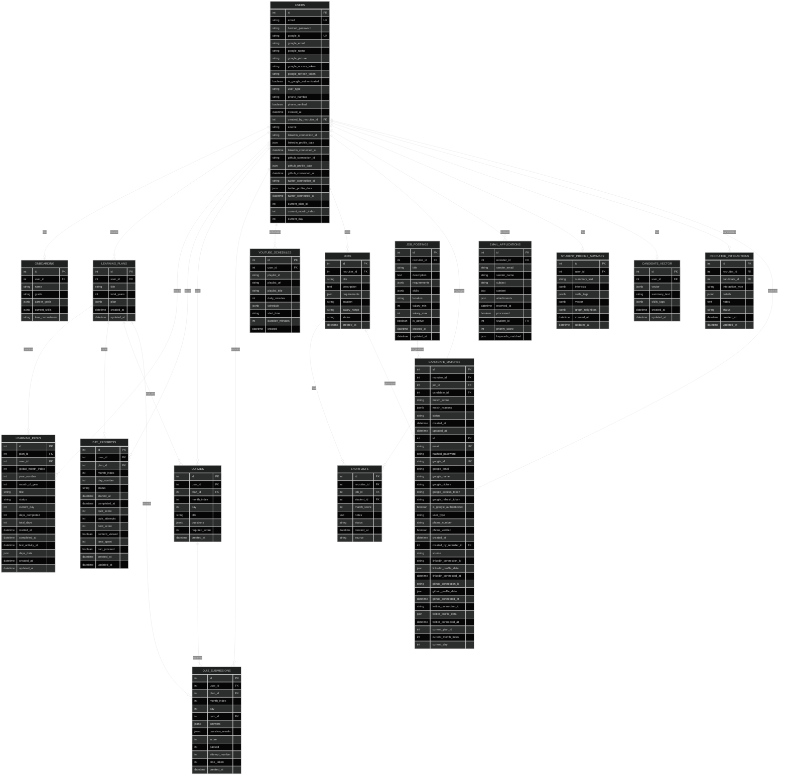

# 🗄️ Complete Database Schema

## Overview
**Total Tables**: 15  
**Total Columns**: 200+  
**Database**: PostgreSQL with JSONB support  
**ORM**: SQLAlchemy

---

## 📊 Entity Relationship Diagram



---

## 📋 Table Definitions

### 1️⃣ **users** - Core User Management
Primary table for both students and recruiters with OAuth integration.

| Column | Type | Constraints | Description |
|--------|------|-------------|-------------|
| `id` | Integer | PRIMARY KEY, INDEX | Unique user identifier |
| `email` | String | UNIQUE, INDEX | User email address |
| `hashed_password` | String | NULLABLE | Hashed password (null for OAuth) |
| `google_id` | String | UNIQUE, NULLABLE | Google OAuth ID |
| `google_email` | String | NULLABLE | Google account email |
| `google_name` | String | NULLABLE | Google account name |
| `google_picture` | String | NULLABLE | Google profile picture URL |
| `google_access_token` | String | NULLABLE | Google OAuth access token |
| `google_refresh_token` | String | NULLABLE | Google OAuth refresh token |
| `is_google_authenticated` | Boolean | DEFAULT FALSE | Google auth status |
| `user_type` | String | DEFAULT 'student' | User role: student/recruiter |
| `phone_number` | String | NULLABLE | Contact phone number |
| `phone_verified` | Boolean | DEFAULT FALSE | Phone verification status |
| `created_at` | DateTime | DEFAULT NOW | Account creation timestamp |
| `created_by_recruiter_id` | Integer | FK(users.id), NULLABLE | Recruiter who added candidate |
| `source` | String | DEFAULT 'platform' | Registration source: platform/email |
| `linkedin_connection_id` | String | NULLABLE | Composio LinkedIn connection |
| `linkedin_profile_data` | String | NULLABLE | LinkedIn profile JSON |
| `linkedin_connected_at` | DateTime | NULLABLE | LinkedIn connection timestamp |
| `github_connection_id` | String | NULLABLE | Composio GitHub connection |
| `github_profile_data` | String | NULLABLE | GitHub profile JSON |
| `github_connected_at` | DateTime | NULLABLE | GitHub connection timestamp |
| `twitter_connection_id` | String | NULLABLE | Composio Twitter connection |
| `twitter_profile_data` | String | NULLABLE | Twitter profile JSON |
| `twitter_connected_at` | DateTime | NULLABLE | Twitter connection timestamp |
| `current_plan_id` | Integer | NULLABLE | Active learning plan ID |
| `current_month_index` | Integer | NULLABLE | Current month in plan |
| `current_day` | Integer | NULLABLE | Current day in month |

**Relationships:**
- `onboarding` → One-to-One with Onboarding
- `learning_plans` → One-to-Many with LearningPlan
- `youtube_schedules` → One-to-Many with YouTubeSchedule
- `jobs` → One-to-Many with Job (as recruiter)

**Indexes:** `id`, `email`, `google_id`

---

### 2️⃣ **onboarding** - Student Profile Setup
Stores initial student information and learning preferences.

| Column | Type | Constraints | Description |
|--------|------|-------------|-------------|
| `id` | Integer | PRIMARY KEY | Unique onboarding ID |
| `user_id` | Integer | FK(users.id), UNIQUE | Associated user |
| `name` | String | NOT NULL | Student full name |
| `grade` | String | NOT NULL | Education level |
| `career_goals` | JSONB | NOT NULL | List of career objectives |
| `current_skills` | JSONB | NOT NULL | List of existing skills |
| `time_commitment` | String | NOT NULL | Daily study time commitment |

**JSONB Structure:**
```json
{
  "career_goals": ["Full Stack Developer", "AI Engineer"],
  "current_skills": ["Python", "JavaScript", "React"]
}
```

**Relationships:**
- `user` → One-to-One with User

---

### 3️⃣ **learning_plans** - Master Learning Plans
High-level learning plan structure spanning multiple years.

| Column | Type | Constraints | Description |
|--------|------|-------------|-------------|
| `id` | Integer | PRIMARY KEY | Unique plan ID |
| `user_id` | Integer | FK(users.id) | Plan owner |
| `title` | String | DEFAULT 'Personalized Learning Plan' | Plan title |
| `total_years` | Integer | NOT NULL | Duration in years (1-3) |
| `plan` | JSONB | NOT NULL | Complete plan structure |
| `created_at` | DateTime | DEFAULT NOW | Plan creation timestamp |
| `updated_at` | DateTime | DEFAULT NOW | Last update timestamp |

**JSONB Structure:**
```json
{
  "months": [
    {
      "index": 1,
      "title": "Python Fundamentals",
      "goals": ["Learn syntax", "Build projects"],
      "topics": ["Variables", "Functions", "OOP"],
      "status": "active",
      "days_generated": true,
      "days": [...]
    }
  ]
}
```

**Relationships:**
- `user` → Many-to-One with User
- `paths` → One-to-Many with LearningPath
- `day_progress` → One-to-Many with DayProgress

---

### 4️⃣ **learning_paths** - Monthly Progress Tracking
Tracks progress through each month of the learning plan.

| Column | Type | Constraints | Description |
|--------|------|-------------|-------------|
| `id` | Integer | PRIMARY KEY | Unique path ID |
| `plan_id` | Integer | FK(learning_plans.id), INDEX | Parent plan |
| `user_id` | Integer | FK(users.id), INDEX | Path owner |
| `global_month_index` | Integer | NOT NULL | Month number (1-36) |
| `year_number` | Integer | NOT NULL | Year in plan (1-3) |
| `month_of_year` | Integer | NOT NULL | Month in year (1-12) |
| `title` | String | NOT NULL | Month title |
| `status` | String | DEFAULT 'locked' | locked/active/completed |
| `current_day` | Integer | DEFAULT 1 | Current day (1-30) |
| `days_completed` | Integer | DEFAULT 0 | Completed days count |
| `total_days` | Integer | DEFAULT 30 | Total days in month |
| `started_at` | DateTime | NULLABLE | Month start timestamp |
| `completed_at` | DateTime | NULLABLE | Month completion timestamp |
| `last_activity_at` | DateTime | NULLABLE | Last activity timestamp |
| `days_data` | JSON | NULLABLE | Day completion details |
| `created_at` | DateTime | DEFAULT NOW | Record creation |
| `updated_at` | DateTime | DEFAULT NOW | Last update |

**Relationships:**
- `plan` → Many-to-One with LearningPlan
- `user` → Many-to-One with User

**Indexes:** `plan_id`, `user_id`

---

### 5️⃣ **day_progress** - Daily Learning Progress
Granular tracking of daily learning activities and quiz performance.

| Column | Type | Constraints | Description |
|--------|------|-------------|-------------|
| `id` | Integer | PRIMARY KEY | Unique progress ID |
| `user_id` | Integer | FK(users.id), INDEX | Student ID |
| `plan_id` | Integer | FK(learning_plans.id), INDEX | Plan ID |
| `month_index` | Integer | INDEX | Month number (1-based) |
| `day_number` | Integer | INDEX | Day number (1-30) |
| `status` | String | DEFAULT 'locked' | locked/active/completed/failed |
| `started_at` | DateTime | NULLABLE | Day start timestamp |
| `completed_at` | DateTime | NULLABLE | Day completion timestamp |
| `quiz_score` | Integer | NULLABLE | Latest quiz score (0-100) |
| `quiz_attempts` | Integer | DEFAULT 0 | Number of quiz attempts |
| `best_score` | Integer | NULLABLE | Best score achieved |
| `content_viewed` | Boolean | DEFAULT FALSE | Content viewed flag |
| `time_spent` | Integer | DEFAULT 0 | Time spent (seconds) |
| `can_proceed` | Boolean | DEFAULT FALSE | Can move to next day |
| `created_at` | DateTime | DEFAULT NOW | Record creation |
| `updated_at` | DateTime | DEFAULT NOW | Last update |

**Relationships:**
- `user` → Many-to-One with User
- `plan` → Many-to-One with LearningPlan

**Indexes:** `user_id`, `plan_id`, `month_index`, `day_number`

---

### 6️⃣ **quizzes** - Quiz Definitions
Stores quiz questions and correct answers for each day.

| Column | Type | Constraints | Description |
|--------|------|-------------|-------------|
| `id` | Integer | PRIMARY KEY | Unique quiz ID |
| `user_id` | Integer | FK(users.id), INDEX | Quiz owner |
| `plan_id` | Integer | FK(learning_plans.id), INDEX | Associated plan |
| `month_index` | Integer | NOT NULL | Month number (1-based) |
| `day` | Integer | NOT NULL | Day number (1-30) |
| `title` | String | NOT NULL | Quiz title |
| `questions` | JSONB | NOT NULL | Quiz questions array |
| `required_score` | Integer | DEFAULT 70 | Passing score percentage |
| `created_at` | DateTime | DEFAULT NOW | Quiz creation timestamp |

**JSONB Structure:**
```json
{
  "questions": [
    {
      "question": "What is Python?",
      "options": ["Language", "Snake", "Framework", "Database"],
      "correct_index": 0,
      "explanation": "Python is a programming language"
    }
  ]
}
```

**Indexes:** `user_id`, `plan_id`

---

### 7️⃣ **quiz_submissions** - Quiz Attempt Records
Records all quiz attempts with detailed results.

| Column | Type | Constraints | Description |
|--------|------|-------------|-------------|
| `id` | Integer | PRIMARY KEY | Unique submission ID |
| `user_id` | Integer | FK(users.id), INDEX | Student ID |
| `plan_id` | Integer | FK(learning_plans.id), INDEX | Plan ID |
| `month_index` | Integer | NOT NULL | Month number |
| `day` | Integer | NOT NULL | Day number |
| `quiz_id` | Integer | FK(quizzes.id), INDEX | Quiz ID |
| `answers` | JSONB | NOT NULL | User's selected answers |
| `question_results` | JSONB | NOT NULL | Detailed results per question |
| `score` | Integer | NOT NULL | Score percentage (0-100) |
| `passed` | Integer | NOT NULL | Pass status (0/1) |
| `attempt_number` | Integer | DEFAULT 1 | Attempt sequence number |
| `time_taken` | Integer | NULLABLE | Time taken (seconds) |
| `created_at` | DateTime | DEFAULT NOW | Submission timestamp |

**JSONB Structure:**
```json
{
  "answers": [0, 2, 1, 3],
  "question_results": [
    {
      "question_index": 0,
      "user_answer": 0,
      "correct_answer": 0,
      "is_correct": true,
      "explanation": "Correct! Python is a programming language."
    }
  ]
}
```

**Indexes:** `user_id`, `plan_id`, `quiz_id`

---

### 8️⃣ **youtube_schedules** - Video Learning Schedules
Manages YouTube playlist schedules and calendar integration.

| Column | Type | Constraints | Description |
|--------|------|-------------|-------------|
| `id` | Integer | PRIMARY KEY | Unique schedule ID |
| `user_id` | Integer | FK(users.id) | Schedule owner |
| `playlist_id` | String | NOT NULL | YouTube playlist ID |
| `playlist_url` | String | NOT NULL | Full playlist URL |
| `playlist_title` | String | NOT NULL | Playlist title |
| `daily_minutes` | Integer | NOT NULL | Daily watch time (minutes) |
| `schedule` | JSONB | NOT NULL | Daily video schedule |
| `start_time` | String | NULLABLE | Daily start time (HH:MM) |
| `duration_minutes` | Integer | NULLABLE | Session duration |
| `created` | DateTime | DEFAULT NOW | Schedule creation |

**JSONB Structure:**
```json
{
  "schedule": [
    {
      "day": 1,
      "videos": [
        {
          "videoId": "abc123",
          "title": "Python Tutorial",
          "thumbnail": "https://...",
          "duration": "PT15M"
        }
      ]
    }
  ]
}
```

**Relationships:**
- `user` → Many-to-One with User

---

### 9️⃣ **student_profile_summaries** - AI-Generated Profiles
AI-generated student summaries for recruiter matching.

| Column | Type | Constraints | Description |
|--------|------|-------------|-------------|
| `id` | Integer | PRIMARY KEY | Unique summary ID |
| `user_id` | Integer | FK(users.id), INDEX | Student ID |
| `summary_text` | String | NOT NULL | AI-generated summary |
| `interests` | JSONB | NOT NULL | List of interests |
| `skills_tags` | JSONB | NOT NULL | Extracted skill tags |
| `vector` | JSONB | NOT NULL | Embedding vector |
| `graph_neighbors` | JSONB | NULLABLE | Related students |
| `created_at` | DateTime | DEFAULT NOW | Summary creation |
| `updated_at` | DateTime | DEFAULT NOW | Last update |

**JSONB Structure:**
```json
{
  "interests": ["AI", "Web Development", "Cloud Computing"],
  "skills_tags": ["Python", "React", "AWS", "Docker"],
  "vector": [0.123, -0.456, 0.789, ...],
  "graph_neighbors": [
    {"user_id": 42, "weight": 0.85},
    {"user_id": 73, "weight": 0.72}
  ]
}
```

**Indexes:** `user_id`

---

### 🔟 **candidate_vectors** - Candidate Embeddings
Vector embeddings for semantic candidate search and matching.

| Column | Type | Constraints | Description |
|--------|------|-------------|-------------|
| `id` | Integer | PRIMARY KEY | Unique vector ID |
| `user_id` | Integer | FK(users.id), INDEX | Candidate ID |
| `vector` | JSONB | NOT NULL | Embedding vector (768-dim) |
| `summary_text` | String | NOT NULL | Text used for embedding |
| `skills_tags` | JSONB | NOT NULL | Extracted skills |
| `created_at` | DateTime | DEFAULT NOW | Vector creation |
| `updated_at` | DateTime | DEFAULT NOW | Last update |

**JSONB Structure:**
```json
{
  "vector": [0.123, -0.456, ...],
  "skills_tags": ["Python", "Machine Learning", "TensorFlow"]
}
```

**Indexes:** `user_id`

---

### 1️⃣1️⃣ **jobs** - Job Postings
Recruiter job postings with requirements and details.

| Column | Type | Constraints | Description |
|--------|------|-------------|-------------|
| `id` | Integer | PRIMARY KEY, INDEX | Unique job ID |
| `recruiter_id` | Integer | FK(users.id), NOT NULL | Posting recruiter |
| `title` | String(200) | NOT NULL | Job title |
| `description` | Text | NOT NULL | Job description |
| `requirements` | JSON | DEFAULT [] | Job requirements list |
| `location` | String(100) | DEFAULT 'Remote' | Job location |
| `salary_range` | String(100) | NULLABLE | Salary range |
| `status` | String(20) | DEFAULT 'active' | Job status |
| `created_at` | DateTime | DEFAULT NOW | Posting timestamp |

**JSON Structure:**
```json
{
  "requirements": [
    "3+ years Python experience",
    "React/Node.js proficiency",
    "AWS cloud experience"
  ]
}
```

**Relationships:**
- `recruiter` → Many-to-One with User

---

### 1️⃣2️⃣ **shortlists** - Candidate Shortlists
Tracks shortlisted candidates for jobs with interview lifecycle.

| Column | Type | Constraints | Description |
|--------|------|-------------|-------------|
| `id` | Integer | PRIMARY KEY, INDEX | Unique shortlist ID |
| `recruiter_id` | Integer | FK(users.id), NOT NULL | Recruiter ID |
| `job_id` | Integer | FK(jobs.id), NOT NULL | Job ID |
| `student_id` | Integer | FK(users.id), NOT NULL | Candidate ID |
| `match_score` | Integer | NULLABLE | AI match score (0-100) |
| `notes` | Text | NULLABLE | Recruiter notes |
| `status` | String(50) | DEFAULT 'shortlisted' | Lifecycle status |
| `created_at` | DateTime | DEFAULT NOW | Shortlist timestamp |
| `source` | String(20) | DEFAULT 'platform' | Source: platform/email |

**Status Values:**
- `shortlisted` - Initially shortlisted
- `interview_scheduled` - Interview scheduled
- `interviewed` - Interview completed
- `hired` - Candidate hired
- `rejected` - Candidate rejected

**Relationships:**
- `recruiter` → Many-to-One with User (recruiter)
- `job` → Many-to-One with Job
- `student` → Many-to-One with User (student)

---

### 1️⃣3️⃣ **email_applications** - Email-Based Applications
Stores applications received via email with resume parsing.

| Column | Type | Constraints | Description |
|--------|------|-------------|-------------|
| `id` | Integer | PRIMARY KEY, INDEX | Unique application ID |
| `recruiter_id` | Integer | FK(users.id), NOT NULL | Receiving recruiter |
| `sender_email` | String(255) | NOT NULL | Applicant email |
| `sender_name` | String(255) | NULLABLE | Applicant name |
| `subject` | String(500) | NOT NULL | Email subject |
| `content` | Text | NOT NULL | Email body |
| `attachments` | JSON | DEFAULT [] | Attachment metadata |
| `received_at` | DateTime | DEFAULT NOW | Email received timestamp |
| `processed` | Boolean | DEFAULT FALSE | Processing status |
| `student_id` | Integer | FK(users.id), NULLABLE | Matched student ID |
| `priority_score` | Integer | DEFAULT 0 | AI priority score |
| `keywords_matched` | JSON | DEFAULT [] | Matched keywords |

**JSON Structure:**
```json
{
  "attachments": [
    {
      "filename": "resume.pdf",
      "size": 245678,
      "mime_type": "application/pdf",
      "parsed_text": "..."
    }
  ],
  "keywords_matched": ["Python", "React", "AWS", "3 years"]
}
```

**Relationships:**
- `recruiter` → Many-to-One with User (recruiter)
- `student` → Many-to-One with User (student, nullable)

---

### 1️⃣4️⃣ **recruiter_interactions** - Interaction History
Tracks all recruiter-candidate interactions and communications.

| Column | Type | Constraints | Description |
|--------|------|-------------|-------------|
| `id` | Integer | PRIMARY KEY | Unique interaction ID |
| `recruiter_id` | Integer | FK(recruiters.id), INDEX | Recruiter ID |
| `candidate_id` | Integer | FK(users.id), INDEX | Candidate ID |
| `interaction_type` | String | NOT NULL | Interaction type |
| `details` | JSONB | NULLABLE | Interaction metadata |
| `notes` | Text | NULLABLE | Interaction notes |
| `status` | String | DEFAULT 'active' | Interaction status |
| `created_at` | DateTime | DEFAULT NOW | Interaction timestamp |
| `updated_at` | DateTime | DEFAULT NOW | Last update |

**Interaction Types:**
- `email_sent` - Email communication
- `profile_viewed` - Profile viewed
- `interview_scheduled` - Interview scheduled
- `interview_completed` - Interview completed
- `offer_sent` - Job offer sent

**JSONB Structure:**
```json
{
  "details": {
    "email_subject": "Interview Invitation",
    "meeting_link": "https://meet.google.com/...",
    "scheduled_time": "2024-01-15T10:00:00Z"
  }
}
```

**Indexes:** `recruiter_id`, `candidate_id`

---

### 1️⃣5️⃣ **job_postings** - Extended Job Details
Additional job posting details for advanced matching.

| Column | Type | Constraints | Description |
|--------|------|-------------|-------------|
| `id` | Integer | PRIMARY KEY | Unique posting ID |
| `recruiter_id` | Integer | FK(recruiters.id), INDEX | Posting recruiter |
| `title` | String | NOT NULL | Job title |
| `description` | Text | NOT NULL | Full job description |
| `requirements` | JSONB | NOT NULL | Requirements list |
| `skills` | JSONB | NOT NULL | Required skills |
| `location` | String | NULLABLE | Job location |
| `salary_min` | Integer | NULLABLE | Minimum salary |
| `salary_max` | Integer | NULLABLE | Maximum salary |
| `is_active` | String | DEFAULT TRUE | Active status |
| `created_at` | DateTime | DEFAULT NOW | Posting timestamp |
| `updated_at` | DateTime | DEFAULT NOW | Last update |

**JSONB Structure:**
```json
{
  "requirements": [
    "Bachelor's degree in CS",
    "5+ years experience",
    "Strong problem-solving skills"
  ],
  "skills": [
    "Python", "Django", "PostgreSQL", 
    "Docker", "Kubernetes", "AWS"
  ]
}
```

**Indexes:** `recruiter_id`

---

## 📈 Database Statistics

| Metric | Count |
|--------|-------|
| **Total Tables** | 15 |
| **Total Columns** | 200+ |
| **Foreign Keys** | 28 |
| **Indexes** | 45+ |
| **JSONB Fields** | 32 |
| **Relationships** | 35+ |

---

## 🔗 Key Relationships Summary

### Student Learning Flow
```
User → Onboarding → LearningPlan → LearningPath → DayProgress → Quiz → QuizSubmission
```

### Recruiter Workflow
```
User(Recruiter) → Job → Shortlist → User(Student)
User(Recruiter) → EmailApplication → User(Student)
```

### AI Matching Pipeline
```
User(Student) → StudentProfileSummary → CandidateVector
Job → Requirements → AI Matching → Shortlist
```

---

## 🎯 Index Strategy

### High-Traffic Queries
- `users.email` - Login lookups
- `users.google_id` - OAuth authentication
- `learning_paths.user_id` - Progress tracking
- `day_progress.user_id, month_index, day_number` - Daily content
- `quiz_submissions.user_id, plan_id` - Quiz history
- `shortlists.recruiter_id, job_id` - Candidate management

### Composite Indexes
- `(user_id, plan_id, month_index, day_number)` - Day progress queries
- `(recruiter_id, job_id, student_id)` - Shortlist lookups
- `(user_id, created_at)` - Timeline queries

---

## 💾 JSONB Usage Patterns

### Learning Content
- `learning_plans.plan` - Hierarchical month/day structure
- `quizzes.questions` - Question arrays with options
- `quiz_submissions.question_results` - Detailed results

### User Profiles
- `onboarding.career_goals` - Dynamic goal lists
- `onboarding.current_skills` - Skill arrays
- `users.linkedin_profile_data` - External profile data

### AI & Matching
- `candidate_vectors.vector` - 768-dimensional embeddings
- `student_profile_summaries.skills_tags` - Extracted skills
- `email_applications.keywords_matched` - NLP results

### Scheduling
- `youtube_schedules.schedule` - Daily video assignments
- `jobs.requirements` - Dynamic requirement lists

---

## 🔒 Data Integrity

### Cascading Deletes
- User deletion → Cascade to all related records
- LearningPlan deletion → Cascade to paths, progress, quizzes
- Job deletion → Cascade to shortlists

### Constraints
- Email uniqueness across users
- Google ID uniqueness for OAuth
- Foreign key constraints on all relationships
- Default values for status fields

---

## 🚀 Performance Optimizations

1. **Indexed Foreign Keys** - All FK columns indexed
2. **JSONB GIN Indexes** - Fast JSONB queries (can be added)
3. **Composite Indexes** - Multi-column query optimization
4. **Timestamp Indexes** - Efficient date range queries
5. **Status Field Indexes** - Fast filtering by status

---

## 📝 Migration Strategy

### Initial Setup
```sql
-- Create all tables in order
CREATE TABLE users ...
CREATE TABLE onboarding ...
CREATE TABLE learning_plans ...
-- etc.
```

### Adding Indexes
```sql
CREATE INDEX idx_users_email ON users(email);
CREATE INDEX idx_learning_paths_user ON learning_paths(user_id);
CREATE INDEX idx_day_progress_composite ON day_progress(user_id, plan_id, month_index, day_number);
```

### JSONB Optimization
```sql
CREATE INDEX idx_candidate_vectors_gin ON candidate_vectors USING GIN (vector);
CREATE INDEX idx_quiz_questions_gin ON quizzes USING GIN (questions);
```

---

## 🎓 Schema Design Principles

1. **Normalization** - Proper 3NF with minimal redundancy
2. **Flexibility** - JSONB for dynamic/nested data
3. **Scalability** - Indexed for growth
4. **Integrity** - Foreign keys enforce relationships
5. **Performance** - Strategic indexing for common queries
6. **Auditability** - Timestamps on all tables
7. **Extensibility** - Easy to add new fields/tables

---

**Schema Version**: 2.0  
**Last Updated**: 2024  
**Database**: PostgreSQL 14+  
**ORM**: SQLAlchemy 2.0+
